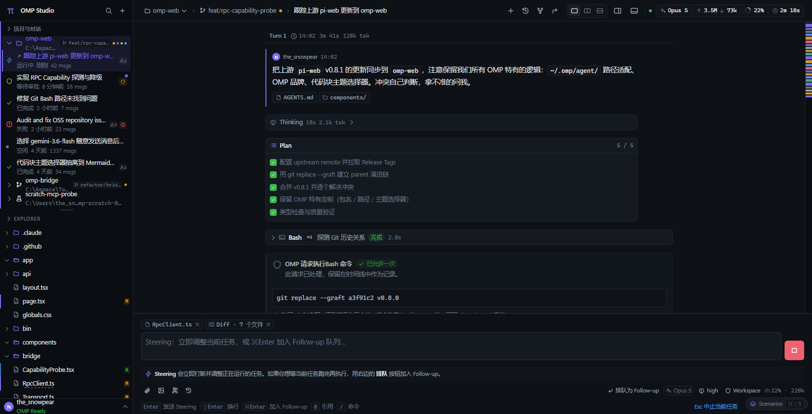

<p align="center">
  
</p>

<h1 align="center">OMP Studio</h1>

<p align="center">
  <strong>Desktop console for OMP Runtime</strong><br>
  Typed Studio Bridge · Electron workbench · Windows first
</p>

<p align="center">
  <a href="README.md">中文</a>
  ·
  <a href="docs/README.md">Docs</a>
  ·
  <a href="CHANGELOG.md">Changelog</a>
  ·
  <a href="https://github.com/can1357/oh-my-pi">oh-my-pi</a>
</p>

<p align="center">
  <a href="https://github.com/the-snowpear/omp-studio/actions/workflows/ci.yml"></a>
  <a href="LICENSE"></a>
  <a href="CHANGELOG.md"></a>
  <a href="docs/getting-started.md"></a>
  <a href="package.json"></a>
</p>

<p align="center">
  
</p>

OMP Studio is a desktop shell for [oh-my-pi](https://github.com/can1357/oh-my-pi) (OMP). Sessions, approvals, Agent Hub, and the workspace are driven through a typed Studio Bridge — not by scraping TUI text, ANSI, or key macros.

> [!IMPORTANT]
> **0.1.0 is a development preview.** The workbench runs from source on Windows. Some panels are honest empty shells. There is no signed installer on GitHub Releases yet. Please file bugs and ideas as [Issues](https://github.com/the-snowpear/omp-studio/issues).

## What it does

- **Conversation workbench** — composer (chips, `@` mentions, slash commands, images), tool cards, session changes, subagents, Plan / Vibe / approvals.
- **Sessions and projects** — local workspace registry, history, archive. The renderer sees opaque ids, never native absolute paths.
- **Agent Hub / Skills / models** — inventory and config go through the Host. Surfaces without a read model stay disabled instead of filling with fake data.
- **Desktop capabilities** — Git, file tree, terminal PTY, notifications, open-in-browser. The control plane stays semantic commands, not glued-together shell.
- **Managed Runtime** — pinned oh-my-pi submodule + overlay + four seam patches; `omp --mode studio-host`. Artifacts are Ed25519-verified.

## Quick start

Node.js 22+ is required. Full steps: [docs/getting-started.md](docs/getting-started.md).

```powershell
git clone --recurse-submodules https://github.com/the-snowpear/omp-studio.git
cd omp-studio
npm install
npm run preview
```

Or double-click `preview.cmd` / `启动预览.cmd` at the repo root.

Attach a real Runtime (slow the first time):

```powershell
npm run omp:install-deps
npm run omp:overlay:apply
npm run omp:keys
npm run omp:build:host
npm run preview
```

Models and login use OMP’s `models.yml` / `omp login`. This repository does not ship provider secrets.

## Layout

```
apps/desktop          Electron main process
apps/renderer         Vite + React workbench
packages/             protocol, Host, client, transports, platform
omp-patch/overlay     Studio-owned Runtime sources
omp-patch/patches     seam patches on upstream files (do not hand-edit)
omp-patch/vendor      oh-my-pi submodule (commit the gitlink only)
packaging/            Windows NSIS installer skeleton
ui_reference/ver1     visual reference, not product code
docs/                 user and contributor docs
```

When changing a product surface, jump from [doc/feature-index.md](doc/feature-index.md) instead of searching the whole tree.

## Architecture

```
Renderer → StudioClient → Desktop IPC → Host facade
                                    ├─ local: session catalog / Git / workspace
                                    └─ Bridge → omp --mode studio-host
```

Invariants (see [docs/architecture.md](docs/architecture.md)):

- When prose and types disagree, `studio-protocol` and `client-contract` win.
- The renderer must never receive bridge tokens, process handles, or OMP session paths.
- Unknown mutations fail closed; `accepted` is not success.
- Runtime loss fences the old epoch and maps unresolved accepted work to `outcome_unknown`.

## Documentation

| | |
|---|---|
| [docs/getting-started.md](docs/getting-started.md) | Run from source |
| [docs/development.md](docs/development.md) | Inner loop, preview mode, patch regen |
| [docs/architecture.md](docs/architecture.md) | Packages and invariants |
| [docs/releasing.md](docs/releasing.md) | Version, tag, installer |
| [CONTRIBUTING.md](CONTRIBUTING.md) | How to open a PR |
| [SECURITY.md](SECURITY.md) | Vulnerability disclosure |
| [CHANGELOG.md](CHANGELOG.md) | User-facing history |
| [omp-patch/README.md](omp-patch/README.md) | Overlay / seam patches |

## Contributing

Issues and PRs are welcome. Please read [CONTRIBUTING.md](CONTRIBUTING.md) and [CODE_OF_CONDUCT.md](CODE_OF_CONDUCT.md).

Do not file security issues publicly. Follow [SECURITY.md](SECURITY.md).

Defects in upstream OMP belong in [can1357/oh-my-pi](https://github.com/can1357/oh-my-pi). This repository only maintains the overlay and four seam patches.

## License

[MIT](LICENSE). Third-party notices: [NOTICE](NOTICE).

The pinned Runtime is [oh-my-pi](https://github.com/can1357/oh-my-pi) (MIT; Pi by Mario Zechner, omp by Can Bölük). Studio’s overlay and seam patches are independent work in this repository, also MIT.
