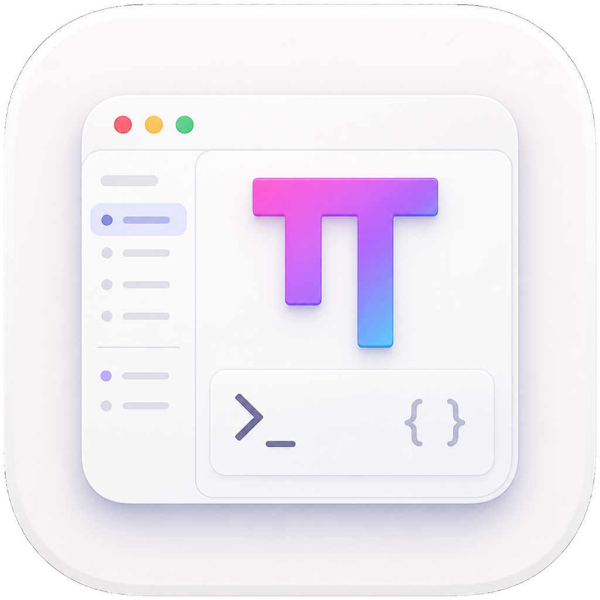
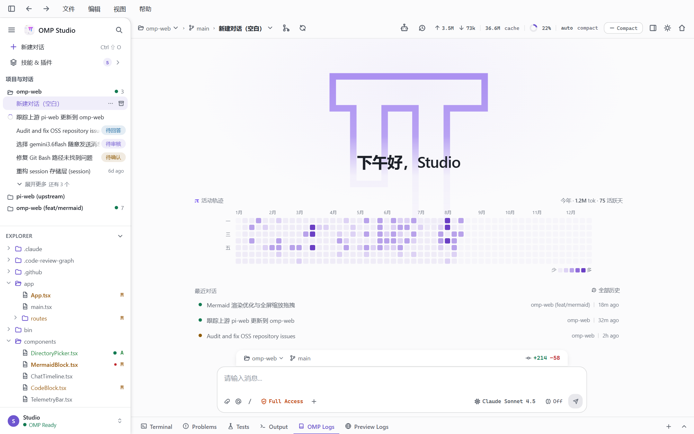
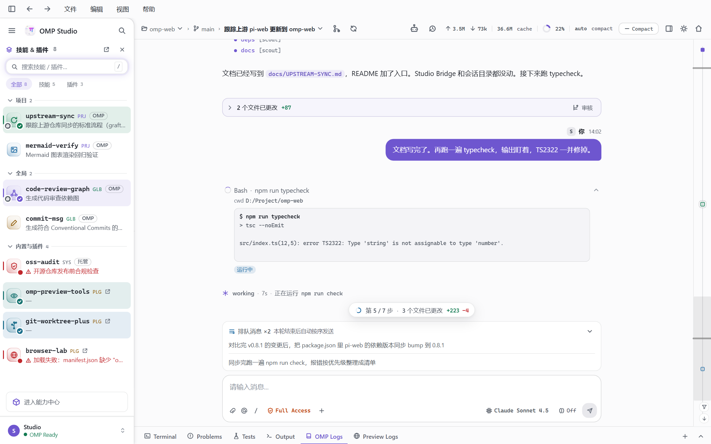
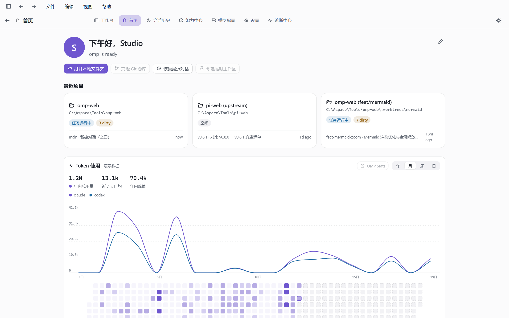
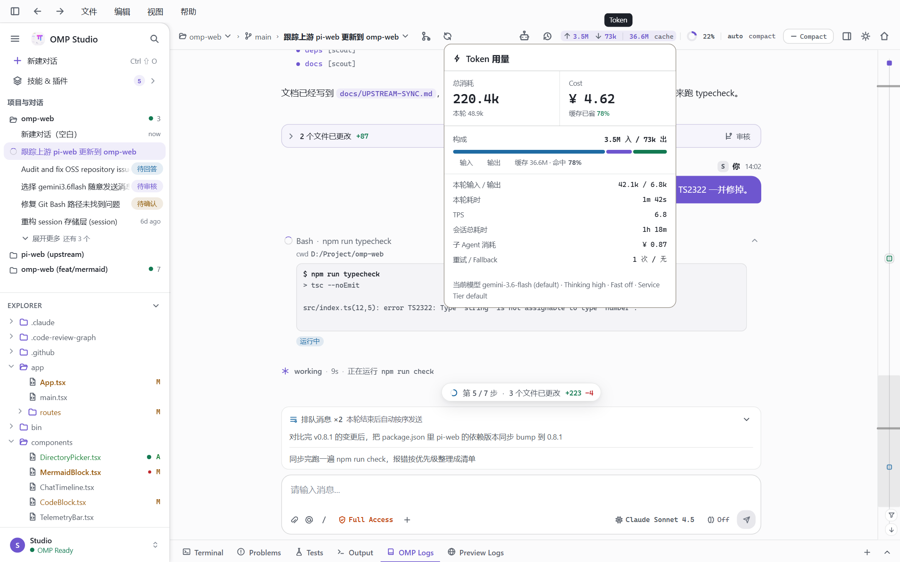
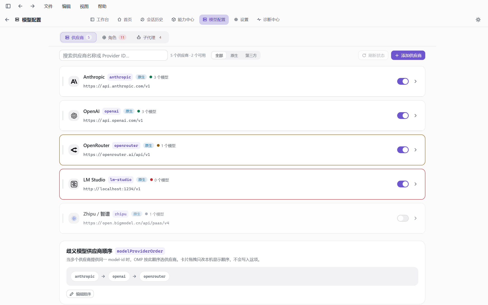
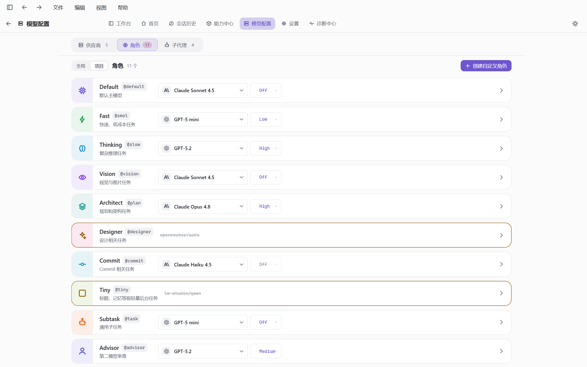
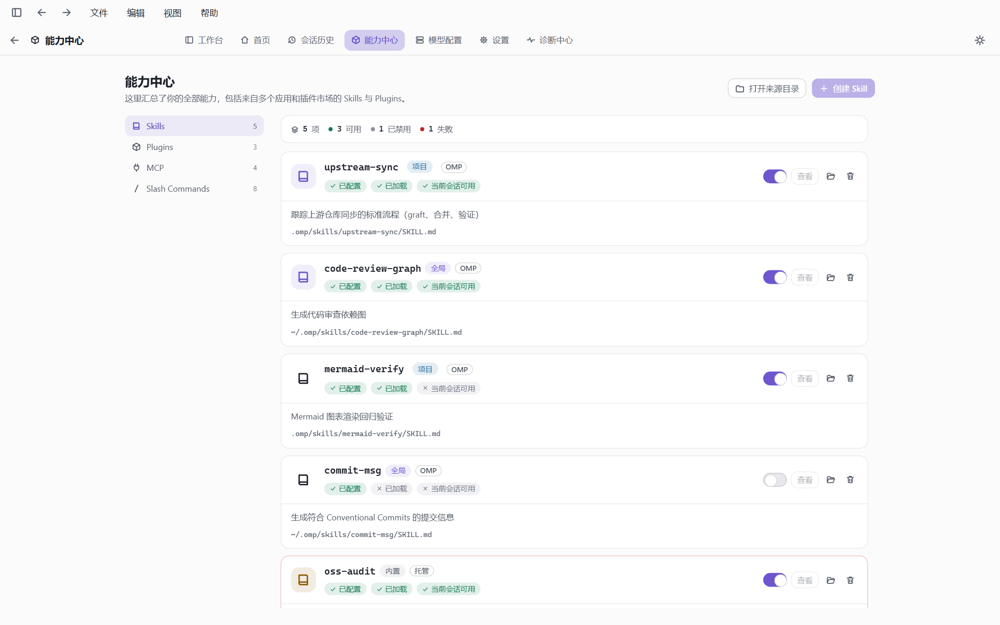
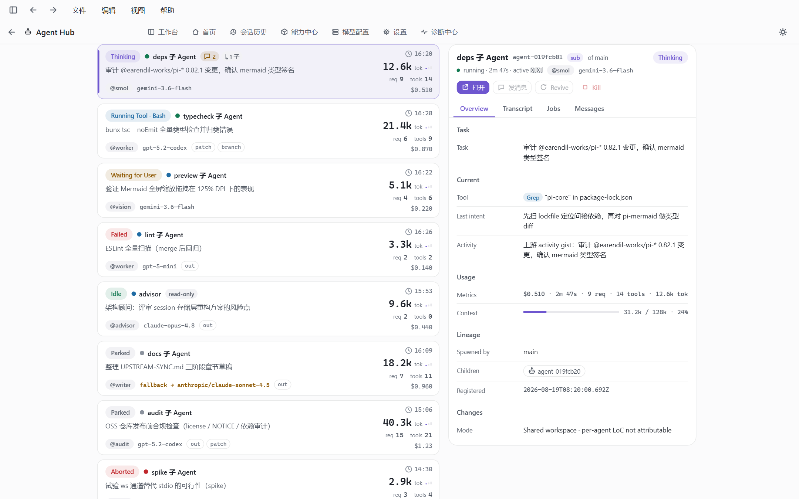
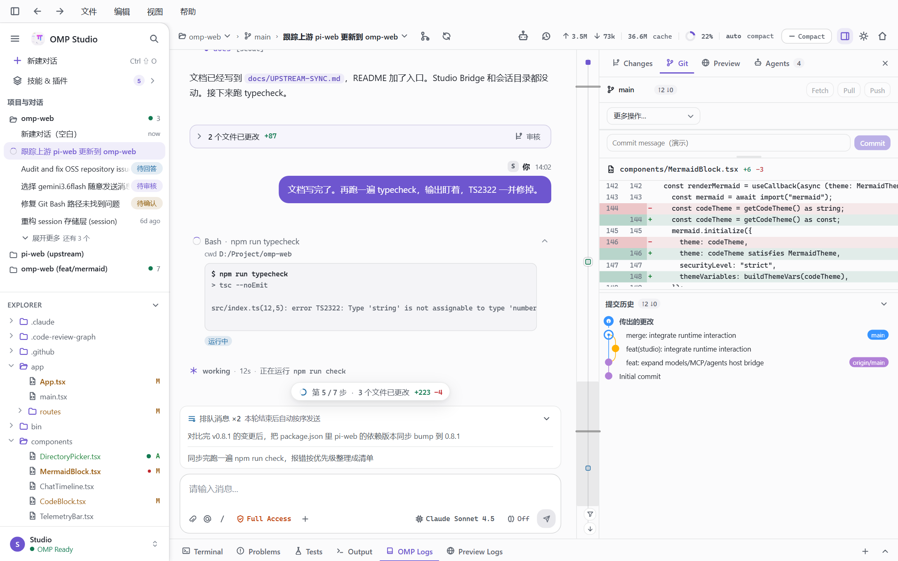

<p align="center">
  
</p>

<h1 align="center">OMP Studio</h1>

<p align="center">
  <strong>OMP Runtime 的桌面控制台</strong><br>
  类型化 Studio Bridge · Electron 工作台 · Windows 优先
</p>

<p align="center">
  <a href="README.en.md">English</a>
  ·
  <a href="docs/README.md">文档</a>
  ·
  <a href="CHANGELOG.md">更新日志</a>
  ·
  <a href="https://github.com/can1357/oh-my-pi">oh-my-pi</a>
</p>

<p align="center">
  <a href="https://github.com/the-snowpear/omp-studio/actions/workflows/ci.yml"></a>
  <a href="LICENSE"></a>
  <a href="CHANGELOG.md"></a>
  <a href="docs/getting-started.md"></a>
  <a href="package.json"></a>
</p>

OMP Studio 是 [oh-my-pi](https://github.com/can1357/oh-my-pi)（OMP）的桌面壳。它把会话、审批、Agent Hub 和工作区接到类型化的 Studio Bridge 上，而不是去解析 TUI 文本、ANSI 或按键宏。

<p align="center">
  
</p>

## 工作台亮点

同一扇窗口里把 Skills、用量、供应商、能力和 Git 收齐，不用在 TUI 和一堆网页之间来回跳。

### 1. 快速选择的 Skills 侧栏

侧栏一键打开技能与插件抽屉，按项目 / 全局 / 内置分组。点「加入」就能把 skill 放进当前草稿，对话里的 `/skill:` 胶囊也能回看刚用过的技能。

<p align="center">
  
</p>

### 2. 好看的数据查看与统计

首页有按年 / 月 / 周 / 日切换的 Token 折线与热力图。对话顶栏随时展开本轮用量、缓存命中、TPS 和子 Agent 花费，Agent Hub 里每个子代理也有自己的数字。

<p align="center">
  
  &nbsp;
  
</p>

### 3. 统一供应商管理

模型配置页把 Anthropic、OpenAI、OpenRouter、本地 LM Studio 等供应商收在一处，开关、端点和 `modelProviderOrder` 同页完成。角色页给 `@default` / `@plan` / `@task` 指定模型和思考强度。

<p align="center">
  
  &nbsp;
  
</p>

### 4. 能力中心管理

Skills、Plugins、MCP、Slash Commands 同一页开关、探测和打开目录。Agent Hub 盯着主会话和子 Agent 的状态、花费与上下文占用。

<p align="center">
  
  &nbsp;
  
</p>

### 5. Git 内嵌便捷工具

右侧 Git 面板直接暂存、看 diff、写 commit，Fetch / Pull / Push 和提交图都在对话旁边，不用离开工作台。

<p align="center">
  
</p>

> [!IMPORTANT]
> **0.1.0 是开发预览。** 工作台可从源码或本地打出的 **未签名** NSIS 安装包在 Windows 上运行；部分面板仍是诚实空壳；GitHub Releases 上还没有 Authenticode 签名安装包。请把 bug 和改进想法开成 [Issue](https://github.com/the-snowpear/omp-studio/issues)。

## 能做什么

- **对话工作台** — Composer（芯片、`@` 提及、slash、图片）、工具卡片、会话变更、子代理、Plan / Vibe / 审批。
- **会话与项目** — 本地工作区注册表、历史、归档；Renderer 只见到不透明 id，看不到本机绝对路径。
- **Agent Hub / Skills / 模型** — 库存与配置走 Host；没有 read model 的表面保持禁用，不用假数据填满。
- **本机能力** — Git、文件树、终端 PTY、系统通知、浏览器打开；控制面仍是语义 command，不是 shell 脚本拼装。
- **托管 Runtime** — 钉住的 oh-my-pi 子模块 + overlay + 四组接缝补丁；`omp --mode studio-host`。工件走 Ed25519 校验。

## 快速开始

需要 Node.js 22+。完整步骤见 [docs/getting-started.md](docs/getting-started.md)。

```powershell
git clone --recurse-submodules https://github.com/the-snowpear/omp-studio.git
cd omp-studio
npm install
npm run preview
```

或双击仓库根目录的 `preview.cmd` / `启动预览.cmd`。

接上真实 Runtime（首次较慢）：

```powershell
npm run omp:install-deps
npm run omp:overlay:apply
npm run omp:keys
npm run omp:build:host
npm run preview
```

模型与登录沿用 OMP 的 `models.yml` / `omp login`。本仓库不内置任何供应商密钥。

## 仓库结构

```
apps/desktop          Electron 主进程
apps/renderer         Vite + React 工作台
packages/             协议、Host、客户端、传输、平台
omp-patch/overlay     Studio 自有 Runtime 源码
omp-patch/patches     对上游文件的接缝补丁（不要手改）
omp-patch/vendor      oh-my-pi 子模块（只提交 gitlink）
packaging/            Windows NSIS 安装器骨架
ui_reference/ver1     视觉参考，不是产品代码
docs/                 使用与开发文档
```

改某一块功能时，从 [doc/feature-index.md](doc/feature-index.md) 跳到文件，不要全库盲搜。

## 架构

```
Renderer → StudioClient → Desktop IPC → Host facade
                                    ├─ 本机：会话目录 / Git / 工作区
                                    └─ Bridge → omp --mode studio-host
```

不变量（详见 [docs/architecture.md](docs/architecture.md)）：

- 类型与散文冲突时，以 `packages/studio-protocol` 与 `client-contract` 为准。
- Renderer 不得拿到 Bridge token、进程句柄或 OMP 会话路径。
- 未知 mutation 失败关闭；`accepted` 不等于成功。
- Runtime 丢失会封旧 epoch，未完成的 accepted 变为 `outcome_unknown`。

## 文档

|                                                    |                    |
| -------------------------------------------------- | ------------------ |
| [docs/getting-started.md](docs/getting-started.md) | 从源码运行              |
| [docs/development.md](docs/development.md)         | 开发循环、预览模式、补丁 regen |
| [docs/architecture.md](docs/architecture.md)       | 包职责与不变量            |
| [docs/releasing.md](docs/releasing.md)             | 版本、tag、安装器         |
| [CONTRIBUTING.md](CONTRIBUTING.md)                 | 如何提 PR             |
| [SECURITY.md](SECURITY.md)                         | 漏洞披露               |
| [CHANGELOG.md](CHANGELOG.md)                       | 面向用户的变更            |
| [omp-patch/README.md](omp-patch/README.md)         | overlay / 接缝补丁     |

## 贡献

欢迎 Issue 与 PR。请先读 [CONTRIBUTING.md](CONTRIBUTING.md) 与 [CODE_OF_CONDUCT.md](CODE_OF_CONDUCT.md)。

不要把安全问题发到公开 Issue。安全报告走 [SECURITY.md](SECURITY.md)。

上游 OMP 本身的缺陷请提到 [can1357/oh-my-pi](https://github.com/can1357/oh-my-pi)。本仓库只维护 overlay 与四组接缝补丁。

## 许可证

[MIT](LICENSE)。第三方声明见 [NOTICE](NOTICE)。

钉住的 Runtime 来自 [oh-my-pi](https://github.com/can1357/oh-my-pi)（MIT；Pi by Mario Zechner，omp by Can Bölük）。Studio 的 overlay 与接缝补丁是本仓库的独立工作，同样以 MIT 授权。
