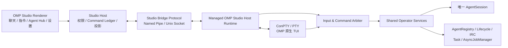
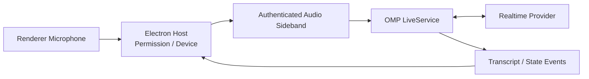
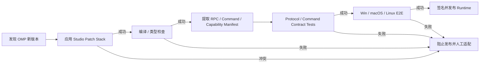

# OMP Studio v5 最终架构

> 状态：最终决策稿  
> 日期：2026-08-10  
> OMP 源码审计基线：`can1357/oh-my-pi@45e12e5bb758198a920c6070e7e64cb33b21beac`  
> 目标：在 OMP Studio 中提供全部 OMP 用户可操作能力、全部指令、完整 Agent Hub 与 Async Job 控制，同时保持可升级、可验证和单运行时写入安全。

---

## 1. 最终决策

OMP Studio 默认使用 **Managed OMP Studio Host Runtime**。

该 Runtime 是由 Studio 管理、钉住上游 OMP 版本、经过完整兼容测试的独立 OMP 可执行程序。它新增 `studio-host` 运行模式，在一个进程、一个 `AgentSession`、一个 `SessionManager` 中同时提供：

1. Studio Bridge 结构化控制通道；
2. OMP 会话、工具和流式事件；
3. 全部内置指令的 typed operator API；
4. Agent Hub 和 Async Job 完整控制 API；
5. 标准 Extension UI 的 Remote UI 桥；
6. OMP 原生 TUI 的内嵌终端兼容面；
7. Live 语音所需的独立音频 sideband。

GUI 和 TUI 是同一 Runtime 的两个操作面，不是两个 backend，不允许两个 OMP 进程同时写同一 session。



---

## 2. Runtime 类型定义

### 2.1 Managed OMP Studio Runtime

由 Studio 下载、校验、安装和选择的 Runtime：

- 包含 Studio Bridge Protocol；
- 通过完整 command、Agent Hub、Job、Remote UI 和三平台 E2E；
- 由 Studio 记录上游 commit、patchset 和 capability hash；
- 支持多版本并存和原子回滚；
- 默认提供 Full Parity。

推荐目录：

```text
%LOCALAPPDATA%/OMP Studio/
  runtimes/
    17.2.12-studio.1/
      omp.exe
      runtime-manifest.json
      checksums.json
    17.2.13-studio.1/
      omp.exe
      runtime-manifest.json
      checksums.json
  current.json
```

### 2.2 Compatible System OMP

用户自行安装的 OMP，但通过 Studio 启动探测，满足完整兼容条件：

- 支持 `studio-host` 或等价 Studio Bridge transport；
- Studio Protocol 版本在支持范围内；
- 提供完整 `CapabilityManifest` 和 `CommandManifest`；
- 具备所有 required Full Parity capabilities；
- 通过本地无副作用 smoke probe；
- 能提供 typed receipt、interaction、Agent Hub 和 Job API；
- 不需要 Studio 根据终端文本猜测语义。

Compatible 描述的是**协议和能力兼容性**，不是安装来源。它可以是：

- 将来正式支持 Studio Protocol 的上游 OMP；
- 用户自行构建的兼容 OMP；
- 企业内部发布的兼容构建；
- Studio Managed Runtime 的外部安装副本。

Compatible System OMP 可以提供与 Managed Runtime 相同的完整 GUI 能力。

### 2.3 Limited System OMP

用户自行安装的普通 OMP，但不满足 Full Parity gate。典型情况：

- 只有现有 RPC v2 或 ACP；
- 没有 Studio Bridge Protocol；
- 没有 typed Operator API；
- 没有 Agent send/spawn/kill/revive/release；
- 没有 Job list/cancel；
- TUI-only 命令仍只有 `handleTui`；
- 无法提供结构化 postcondition。

Limited Runtime 可以提供经过探测确认的基础能力，例如：

- prompt、steer、follow-up、abort；
- 流式 text/thinking/tool events；
- session history、model、thinking、fast；
- 现有 RPC session operations；
- subagent observation/list/transcript；
- ACP Plan/Fork（选择 ACP backend 时）。

Limited Runtime 不得被标记为 Full Parity。缺失控制必须显示为 disabled/limited，不能静默改用 PTY 宏、private import 或模型提示词。

### 2.4 三者的产品差异

| 项目 | Managed Runtime | Compatible System OMP | Limited System OMP |
|---|---|---|---|
| 安装者 | Studio | 用户/系统 | 用户/系统 |
| Studio Protocol | 必须 | 必须 | 通常没有 |
| Full Command Manifest | 是 | 是 | 否或部分 |
| 全部内置指令 GUI | 是 | 是 | 否 |
| Agent Hub 完整控制 | 是 | 是 | 仅观察或缺失 |
| Job list/cancel | 是 | 是 | 缺失或只读 |
| Remote UI | 是 | 是 | 仅现有 rpc-ui 子集 |
| 任意 TUI 人工兼容 | 是 | 兼容实现必须提供 | 只能作为独立外部终端 |
| Studio 自动升级 | 是 | 由系统包管理器负责 | 由系统包管理器负责 |
| Studio 回滚 | 是 | 否 | 否 |
| 默认推荐 | 是 | 用户主动选择 | 仅兼容/诊断用途 |

---

## 3. 产品目标与能力承诺

### 3.1 Full Parity 的定义

Full Parity 表示：

1. OMP 当前所有内置用户操作均可从 Studio 调用；
2. OMP 当前所有内置指令均出现在 Studio Command Manifest；
3. Agent Hub 的观察和控制能力完整可用；
4. Async Job 的 list/get/cancel/subscribe 可用；
5. 所有标准 Extension UI 交互可远程显示和响应；
6. 未知或任意自定义 TUI Component 可在 Studio 内嵌终端中人工操作；
7. 所有 mutation 都有 typed receipt、权限检查和 postcondition；
8. Studio 不伪造 OMP 没有产生的成功状态。

Full Parity 不代表：

- 将所有未来第三方自定义 TUI 自动翻译成原生 React；
- 允许 Studio 通过屏幕识别或按键宏自动操作未知界面；
- 由 Studio 重新实现 OMP 的 agent、tool、approval、session 或 job 语义。

### 3.2 三层呈现策略

| 层级 | 呈现 | 适用范围 | 产品等级 |
|---|---|---|---|
| Native GUI | 专用 React 页面、按钮、表单、面板 | 所有 OMP 内置能力、Agent Hub、Job、设置 | stable |
| Generic Remote UI | 通用 confirm/select/input/editor/progress/approval | 标准扩展和结构化新增命令 | stable |
| TUI Compatibility | 内嵌 OMP 原生终端，用户人工操作 | 任意自定义 TUI Component、未知插件界面 | supported-compatibility |

所有能力都必须至少落入其中一层。新增命令没有分类时，兼容 CI 必须阻止 Runtime 发布。

---

## 4. 源码核验后的关键约束

本架构基于以下已验证事实：

1. `SlashCommandSpec.handle` 可在 TUI、ACP 和 RPC prompt dispatcher 中执行；
2. `handleTui` 依赖 `InteractiveModeContext`，不在 headless command manifest 中；
3. 对 `handleTui`-only 命令发送 RPC `prompt("/plan")` 会退化为普通模型提示；
4. 当前列出的 `/plan`、`/plan-review`、`/vibe`、`/goal`、`/guided-goal`、`/loop`、`/queue`、`/clear`、`/drop`、`/retry`、`/tree`、`/fork`、`/btw`、`/tan`、`/omfg`、`/pause`、`/live` 均为 TUI-only 注册；
5. ACP 有正式 Plan mode 和 session fork，但不是 RPC Thread 的临时 fallback；
6. RPC 已有 subagent lifecycle/progress/events/list/transcript，但没有完整 Agent Control；
7. Agent message/kill/revive 的正确语义位于 Agent Hub/Collab/Lifecycle 内部；
8. Job list/cancel 的正确语义位于 AsyncJobManager 和 Hub tool；
9. Session JSONL 没有跨进程 owner lock，不允许 RPC/TUI 双进程打开同一 session；
10. Streaming queues、approval、provider state、subagents、jobs、host tools 等包含进程内状态，flush JSONL 不等于 runtime checkpoint；
11. ANSI/TUI 输出不能作为 semantic event 或成功 receipt。

因此 v5 不采用“RPC 缺能力时临时启动 TUI，执行后再切回”的设计。

---

## 5. 不可变架构约束

### 5.1 单 Runtime Owner

- 每个 live Thread 只有一个 `StudioHostRuntimeActor`；
- 每个 runtime epoch 只有一个 OMP process；
- 每个 OMP session file 只有一个 writer；
- GUI 与 TUI 共用同一个 `AgentSession`；
- Renderer 永远不能持有 session path、process handle 或 OMP 内部对象。

### 5.2 OMP 仍是业务真值

OMP 负责：

- conversation 和 message；
- model/provider request；
- tool execution 和 approval；
- compaction/retry；
- plan/goal/vibe/loop runtime；
- session/tree/fork；
- AgentRegistry、Lifecycle、IRC；
- TaskTool 和 AsyncJobManager；
- skills/plugins/rules/MCP；
- Live session。

Studio 只负责：

- UI 和用户意图；
- OMP 状态投影；
- Command Ledger 和 receipt；
- runtime/workspace binding；
- 权限、审计和安全策略；
- Runtime 安装、选择、升级和回滚。

### 5.3 不从展示推断语义

以下数据不得生成 durable semantic state：

- ANSI/OSC/TUI 字节；
- stderr 正则；
- Markdown 文本中的“成功”字样；
- 命令回显；
- 模型声称自己执行了某个本地命令；
- 固定坐标、行号、Tab 次数或键盘宏。

---

## 6. Studio Host Runtime

### 6.1 启动模型

Managed/Compatible Runtime 提供：

```bash
omp --mode studio-host \
  --studio-endpoint <opaque-local-endpoint> \
  --studio-token-file <one-time-token-file> \
  --workspace <cwd> \
  --session <optional-session-binding>
```

要求：

- endpoint 仅允许本机 Named Pipe/Unix Domain Socket；
- token 不出现在 Renderer、URL 或普通日志；
- Windows pipe 使用当前用户 ACL；
- Runtime 建立连接后立即删除或作废一次性 token；
- Studio Host 启动整个 process containment domain；
- PTY 和 Studio Bridge 是两个独立 transport。

### 6.2 Transport 分离

```text
Studio Bridge:
  structured request / response / event / snapshot / receipt

PTY:
  raw terminal bytes / resize / user keyboard / arbitrary TUI

Audio Sideband:
  microphone frames / realtime audio / live transport state
```

三个 transport 不混帧；PTY 字节不进入 semantic event stream；音频不进入普通 JSON frame。

### 6.3 SessionBinding

```ts
export interface SessionBinding {
  threadId: string;
  environmentId: string;
  workspaceId: string;
  runtimeId: string;
  runtimeEpoch: number;
  runtimeKind: "managed" | "compatible-system" | "limited-system";
  backend: "studio-host" | "rpc-ui" | "acp";
  runtimeVersion: string;
  upstreamVersion: string;
  upstreamCommit: string;
  ompSessionId?: string;
  capabilityHash: string;
  commandManifestHash?: string;
}
```

Full Parity 只允许：

```text
runtimeKind = managed | compatible-system
backend     = studio-host
```

Limited System OMP 可以使用 `rpc-ui` 或 `acp`，但产品必须显式显示 Limited。

---

## 7. Studio Bridge Protocol

### 7.1 握手

```ts
export interface StudioHelloRequest {
  type: "studio.hello";
  requestId: string;
  supportedProtocolVersions: number[];
  requiredProfile: "full-parity-v1";
}

export interface StudioHelloResponse {
  type: "studio.hello.result";
  requestId: string;
  selectedProtocolVersion: number;
  runtimeVersion: string;
  upstreamVersion: string;
  upstreamCommit: string;
  runtimeInstanceId: string;
  runtimeEpoch: number;
  capabilityManifest: CapabilityManifest;
  commandManifestHash: string;
  stateVersion: number;
}
```

### 7.2 请求 envelope

```ts
export interface StudioRequest<TStudioOperation> {
  type: "studio.request";
  requestId: string;
  runtimeEpoch: number;
  expectedStateVersion?: number;
  idempotencyKey?: string;
  operation: TStudioOperation;
}
```

### 7.3 Receipt

```ts
export interface StudioReceipt<TResult = unknown> {
  type: "studio.receipt";
  requestId: string;
  commandId?: string;
  runtimeEpoch: number;
  stateVersion: number;
  status:
    | "accepted"
    | "completed"
    | "rejected"
    | "failed"
    | "outcome_unknown";
  result?: TResult;
  error?: {
    code: string;
    message: string;
    retryable: boolean;
    details?: Record<string, unknown>;
  };
}
```

### 7.4 事件排序

每个结构化事件带：

```ts
interface StudioEventEnvelope<T> {
  type: "studio.event";
  runtimeEpoch: number;
  eventSeq: number;
  stateVersion: number;
  occurredAt: string;
  event: T;
}
```

规则：

- `runtimeEpoch` 变化后，旧 epoch 事件全部丢弃；
- `eventSeq` 只在一个 Runtime 内单调递增；
- `stateVersion` 在可观察状态提交后递增；
- 高频 text delta 可以进入独立 ephemeral stream；
- message/tool/approval/agent/job terminal lifecycle 必须发 durable semantic event；
- 断流后客户端先请求 snapshot，再从 snapshot 之后恢复。

---

## 8. Command Manifest 与全部指令覆盖

### 8.1 Command Manifest

Runtime 启动时生成完整命令清单：

```ts
export interface OperatorCommandManifestEntry {
  id: string;
  name: string;
  aliases: string[];
  description: string;
  source:
    | "builtin"
    | "extension"
    | "skill"
    | "prompt-template"
    | "file-command";
  implementation:
    | "shared-service"
    | "headless-handle"
    | "extension-command"
    | "tui-compatibility";
  argumentSchema?: Record<string, unknown>;
  interactionKinds: Array<"confirm" | "select" | "input" | "editor" | "approval">;
  presentation: "native" | "generic-form" | "terminal";
  availability: "available" | "disabled" | "blocked";
  risk: "normal" | "sensitive" | "destructive";
  effect: "read" | "session" | "workspace" | "process" | "external";
}
```

命令来源全部纳入：

- built-in `handle`；
- built-in `handleTui` 经共享 service；
- extension commands；
- skill commands；
- file/prompt templates；
- CLI-only administration commands单独进入 Admin Manifest；
- 任意自定义 TUI action 至少提供 terminal compatibility 入口。

### 8.2 禁止 raw Slash 模拟

GUI 点击 `/plan` 时不得发送：

```json
{ "type": "prompt", "message": "/plan" }
```

必须发送 typed operation：

```json
{
  "type": "studio.request",
  "operation": {
    "kind": "mode.plan.enter",
    "initialPrompt": "分析这个项目"
  }
}
```

Slash 字符串只用于：

- 用户在 TUI 中手动输入；
- Studio 命令搜索框的显示名称；
- 已验证 `handle` command 的兼容文本入口；
- 不作为 typed operator API 的内部传输格式。

### 8.3 Shared Operator Services

将现有 `InteractiveMode`/Controller 业务逻辑抽成无界面 service：

```text
packages/coding-agent/src/studio/
  protocol/
  manifest/
  runtime/
  interactions/
  services/
    plan-service.ts
    goal-service.ts
    vibe-service.ts
    loop-service.ts
    session-control-service.ts
    ephemeral-turn-service.ts
    tan-service.ts
    omfg-service.ts
    pause-service.ts
    live-service.ts
```

TUI handler 只做输入解析和展示；Studio operator handler 调用同一个 service。

### 8.4 当前关键指令映射

| 指令 | Shared Service / Primitive | Native GUI | 交互 |
|---|---|---|---|
| `/plan` | `PlanService.enter/exit` | Plan Toggle + 初始提示 | confirm |
| `/plan-review` | `PlanService.openReview/respond` | Markdown 审阅器 | approval/editor |
| `/vibe` | `VibeService.enter/exit` | Vibe 面板 | confirm |
| `/goal` | `GoalService` | 目标管理抽屉 | select/input/confirm |
| `/guided-goal` | `GoalService.startGuided` | Guided Goal 状态 | 普通 conversation |
| `/loop` | `LoopService` | 开关、prompt、次数/时间限制 | input |
| `/queue` | `AgentSession.followUp` | Pending Queue | 无 |
| `/clear` | `resetSessionContext` | 清空上下文确认 | confirm |
| `/drop` | `newSession({ drop: true })` | 危险删除确认 | destructive confirm |
| `/retry` | `AgentSession.retry` | Retry 按钮 | 无 |
| `/tree` | `getTree/navigateTree` | 可视化会话树 | select/confirm/editor |
| `/fork` | `AgentSession.fork` | Fork 按钮 | confirm |
| `/btw` | `EphemeralTurnService` | 侧边问答面板 | stream/copy/branch |
| `/tan` | `TanService` | Background Task 卡片 | input |
| `/omfg` | `OmfgService.generate/validate/commit` | Rule 向导 | editor/select/confirm |
| `/pause` | `agentPauseGate` | 全局 Pause Bar | resume |
| `/live` | `LiveService` + Audio Sideband | Live 语音面板 | device/auth |

其余 OMP built-ins 必须按同一原则进入 manifest；本表不是命令覆盖上限。

---

## 9. Remote UI Protocol

### 9.1 标准交互

```ts
export type RemoteInteractionRequest =
  | {
      kind: "confirm";
      interactionId: string;
      commandId: string;
      title: string;
      message: string;
      destructive?: boolean;
    }
  | {
      kind: "select";
      interactionId: string;
      commandId: string;
      title: string;
      options: Array<{ id: string; label: string; description?: string }>;
      multiple?: boolean;
    }
  | {
      kind: "input";
      interactionId: string;
      commandId: string;
      title: string;
      placeholder?: string;
      secret?: boolean;
    }
  | {
      kind: "editor";
      interactionId: string;
      commandId: string;
      title: string;
      content?: string;
      language?: string;
      promptStyle?: boolean;
    }
  | {
      kind: "approval";
      interactionId: string;
      commandId: string;
      approvalType: string;
      details: unknown;
    };
```

```ts
export interface RemoteInteractionResponse {
  kind: "interaction.respond";
  interactionId: string;
  commandId: string;
  decision: "submit" | "cancel";
  value?: unknown;
}
```

### 9.2 交互所有权

- 一个 interaction 只能有一个 owner；
- GUI 发起的 operator command 默认由 GUI 回答；
- TUI 手动发起的 command 默认由 TUI 回答；
- 用户可以显式“转到终端继续”，转移 interaction lease；
- 旧 interactionId、旧 runtimeEpoch 和旧 lease generation 的 response 被拒绝；
- Renderer 刷新不能自动批准或取消高风险 interaction。

### 9.3 任意自定义 TUI

无法映射为标准 Remote UI 的第三方组件：

1. Studio 显示 `Open in OMP Terminal`；
2. 打开同一 Runtime 的 PTY 视图；
3. 用户人工完成交互；
4. Runtime 仍通过结构化 session/agent/job event 更新 Studio；
5. Studio 不解析屏幕内容判断结果。

---

## 10. Agent Hub 完整能力

### 10.1 Agent API

```ts
export type AgentOperation =
  | { kind: "agent.list"; includeTerminal?: boolean; includePersisted?: boolean }
  | { kind: "agent.get"; agentId: string }
  | {
      kind: "agent.spawn";
      definition: string;
      assignment: string;
      context?: string;
      async?: boolean;
      isolation?: string;
      effort?: string;
    }
  | {
      kind: "agent.send";
      agentId: string;
      expectedGeneration: number;
      text: string;
      mode: "prompt" | "steer" | "followUp";
    }
  | { kind: "agent.kill"; agentId: string; expectedGeneration: number }
  | { kind: "agent.revive"; agentId: string; expectedGeneration: number }
  | { kind: "agent.release"; agentId: string; expectedGeneration: number }
  | { kind: "agent.transcript.read"; agentId: string; cursor?: string; limit?: number }
  | { kind: "agent.subscribe"; level: "progress" | "events" };
```

### 10.2 必须复用 OMP 原始语义

| 能力 | 唯一允许的语义实现 |
|---|---|
| roster/status | `AgentRegistry` |
| lifecycle | `AgentLifecycleManager` |
| message | `IrcBus` + `ensureLive` + prompt/steer/follow-up |
| spawn | `TaskTool` 同一 preflight、policy、isolation 和 adoption 路径 |
| kill | abort + `release({ tombstone: true })` |
| revive | `AgentLifecycleManager.ensureLive` |
| release | `AgentLifecycleManager.release` |
| transcript | 现有增量 transcript reader，返回 opaque cursor |
| progress/events | 现有 subagent EventBus |

禁止：

- Studio 自己创建一个“看起来像 subagent”的 SDK session；
- 直接 `AgentRegistry.unregister` 冒充 kill；
- 直接 raw `AgentSession.abort` 冒充 lifecycle release；
- 让模型调用 `task` 后把模型文本当 spawn receipt；
- 把真实 `sessionFile` 返回 Renderer。

### 10.3 Agent CAS

所有 mutation 必须带 `expectedGeneration`。如果 agent 已被 revive、release 或替换，旧页面操作返回 conflict，而不是作用于新的同名 agent。

### 10.4 Agent Hub GUI

必须支持：

- 层级和 parent/child；
- agent id、display name、definition；
- status、generation、start time、elapsed；
- current assignment、progress、summary；
- token、cost、thinking/effort；
- unread message；
- live transcript；
- Send、Steer、Follow-up；
- Spawn、Kill、Revive、Release；
- 打开会话、复制结果；
- 关联 Job 和终止原因；
- parked/persisted/terminal agent 显式区分。

---

## 11. Async Job 完整能力

```ts
export type JobOperation =
  | { kind: "job.list"; ownerAgentId?: string; includeRecent?: boolean }
  | { kind: "job.get"; jobId: string }
  | {
      kind: "job.cancel";
      jobId: string;
      expectedGeneration: number;
    }
  | { kind: "job.subscribe" };
```

规则：

- 复用 `AsyncJobManager`；
- owner scope 与 OMP Hub tool 一致；
- Job 和 Agent 是不同实体；
- cancel receipt 必须表明 `cancelled`、`already_terminal` 或 `not_owner`；
- jobless agent fallback 与 OMP Harness 语义一致；
- Runtime 退出时未确认结果标记 `outcome_unknown`，不得自动重放。

---

## 12. Input & Command Arbiter

GUI 和内嵌 TUI 可操作同一 Runtime，必须有统一仲裁。

```ts
export interface RuntimeControlLease {
  holder: "gui" | "tui" | "system";
  generation: number;
  acquiredAt: string;
  expiresAt?: string;
  commandId?: string;
  interactionId?: string;
}
```

规则：

1. prompt/steer/follow-up 使用 AgentSession 现有 queue semantics；
2. session destructive mutation 必须持独占 lease；
3. plan/goal/vibe 模式切换串行执行；
4. tree/fork/drop/clear 在 streaming、compacting、approval、active interaction 时按 service precondition 拒绝；
5. 一个 interaction 未结束时，不允许第二个 surface 回答；
6. TUI 键盘输入永远不能绕过 arbiter；
7. Runtime crash 后未得到 terminal receipt 的命令进入 `outcome_unknown`；
8. 具有外部副作用的命令不自动 retry。

---

## 13. 状态模型

```ts
export interface OperatorStateSnapshot {
  runtimeEpoch: number;
  stateVersion: number;
  sessionId: string;
  isStreaming: boolean;
  isCompacting: boolean;
  activeMode: "normal" | "plan" | "goal" | "vibe";
  plan?: PlanState;
  goal?: GoalState;
  vibe?: VibeState;
  loop?: LoopState;
  pause?: PauseState;
  live?: LiveState;
  pendingMessages: number;
  pendingInteraction?: InteractionSummary;
  activeCommandIds: string[];
  agentRevision: number;
  jobRevision: number;
}
```

GUI enable/disable 只能依据结构化 snapshot/event。例如：

- Plan 活跃时禁用 Goal/Vibe enter；
- Vibe 活跃时阻止 session transition；
- Streaming 时按服务 precondition 控制 clear/drop/retry；
- Live 活跃时禁用冲突的 STT；
- Pause 活跃时突出显示全局 Resume；
- pending destructive interaction 时禁用重复提交。

---

## 14. Session、持久化与恢复

### 14.1 OMP Session 权威

- OMP JSONL 和 artifacts 是 OMP durable truth；
- Studio 不直接写 OMP session 文件；
- Studio 只持有 opaque binding 和 projection；
- Runtime 负责 flush、fork、tree、drop、reset boundary；
- Runtime 返回 session identity 和 structured outcome，不向 Renderer暴露路径。

### 14.2 Studio 持久化

Studio 持久化：

- Environment/Workspace/Thread；
- RuntimeBinding/SessionBinding；
- CommandLedger；
- capability/command manifest hash；
- GUI layout、panel state、draft；
- security grants；
- runtime installation metadata；
- diagnostic references。

### 14.3 Crash 恢复

- 已收到 terminal receipt：按 receipt 投影；
- 未收到 terminal receipt：进入 `outcome_unknown`；
- 重启 Runtime 后先请求 snapshot；
- 对 session、agent、job identity 做 reconcile；
- 工具外部副作用未知时不自动重放；
- streaming tail 只标记 interrupted，不伪造 completed message。

---

## 15. Live 语音架构

Live 使用独立 media plane：



要求：

- Renderer 不直接连接 OMP 子进程；
- Electron Host 管理麦克风权限；
- audio frames 不进入 Command Ledger；
- Live start/stop/status 仍通过 Studio Bridge；
- transcript 和 delegation 使用 structured events；
- Runtime shutdown 前必须 stop Live；
- Limited System OMP 没有 media sideband 时禁用 Native Live GUI，可打开其独立 TUI 但不宣称完整集成。

---

## 16. Runtime 选择策略

用户设置：

```text
Runtime mode:
  ● Managed Runtime — Recommended
  ○ System OMP
  ○ Custom executable
```

### 16.1 Managed

- 总是使用 Studio 验证过的 Runtime；
- 提供 Full Parity；
- Studio 管理升级和回滚。

### 16.2 System/Custom

启动只读 probe：

```text
resolve executable
  -> read version/build identity
  -> try Studio Hello
  -> negotiate protocol
  -> validate required capability set
  -> retrieve command manifest
  -> run no-side-effect smoke probe
  -> Compatible OR Limited
```

判定必须是运行时事实，不能依据可执行文件名或版本字符串猜测。

### 16.3 Limited 用户体验

Limited 模式必须：

- 顶部持续显示 Limited Runtime；
- 能力页列出缺失 protocol/capability；
- 缺失按钮显示 disabled 和原因；
- 提供“一键切换 Managed Runtime”；
- 不在后台启动 Managed/TUI 操作同一 session；
- 不用宏补齐缺失能力；
- 允许用户在独立终端使用其 system OMP，但该终端不接管当前 Studio Thread。

---

## 17. Runtime 更新与回滚

### 17.1 发布流水线



“上游没有修改相关文件”只能作为快速信号，不能代替契约测试。依赖、初始化顺序和默认设置变化同样可能改变语义。

### 17.2 原子安装

```text
download
  -> verify signature and SHA-256
  -> unpack into new version directory
  -> launch isolated self-test process
  -> Studio Hello + manifest validation
  -> smoke test
  -> atomically update current.json
```

### 17.3 Thread 与版本

- 新 Runtime 默认只用于新 Thread；
- 活跃 Thread 继续绑定旧 Runtime；
- 不执行进程内热升级；
- Runtime 文件必须允许多版本并存；
- 用户可以一键回滚 default version；
- 删除旧 Runtime 前确认没有 SessionBinding 引用；
- Managed Runtime 更新失败不影响 Studio App 本体更新。

---

## 18. Compatibility CI

### 18.1 必测矩阵

- Studio supported baseline OMP；
- upstream current main/tag；
- Managed patched Runtime；
- Windows、macOS、Linux；
- cold start、resume、crash restart；
- Managed、Compatible System、Limited System 分类。

### 18.2 Command gate

对每个运行时提取所有 command：

- primary name 和 aliases；
- `handle` / `handleTui` / extension / skill / template；
- argument schema；
- UI requirements；
- side effect/risk；
- Studio presentation route；
- contract test id。

以下情况阻止 Full Parity Runtime 发布：

- 新命令没有 route；
- `handleTui` 命令没有 shared service 或 terminal compatibility 分类；
- destructive command 没有 confirmation/receipt；
- typed schema 与实际 handler 漂移；
- manifest hash 变化但没有审查；
- GUI 显示 available 而 contract test 失败。

### 18.3 Agent Hub/Job gate

必须覆盖：

- spawn/send/steer/follow-up；
- running/parked/reviving/terminal 状态；
- kill tombstone；
- revive generation CAS；
- release；
- transcript cursor；
- parent/descendant scope；
- job list/get/cancel；
- jobless-agent fallback；
- stale generation conflict；
- runtime crash `outcome_unknown`。

### 18.4 UI gate

- confirm/select/input/editor/approval；
- GUI→TUI interaction transfer；
- Renderer refresh/reconnect；
- stale interaction response；
- arbitrary TUI manual compatibility；
- PTY ANSI/OSC injection 不得生成 semantic success。

---

## 19. 安全模型

### 19.1 Renderer 最小权限

Renderer 只能使用 Studio Host 的 domain API，不得直接访问：

- OMP pipe/token；
- OMP stdin/stdout；
- session file path；
- AgentRegistry/AgentSession object；
- process handle/PID；
- Runtime 安装目录写权限；
- microphone raw device handle。

### 19.2 Bridge 安全

- local-only transport；
- one-time authentication；
- OS user ACL；
- request body size limit；
- typed schema validation；
- per-operation capability scope；
- runtimeEpoch/stateVersion/generation fencing；
- destructive command explicit confirmation；
- sensitive values redacted from logs；
- no arbitrary JavaScript/module invoke；
- no arbitrary filesystem path from Renderer。

### 19.3 Private OMP internals

Managed Runtime 可以在其自身编译边界内使用 OMP internal services，但 Studio Host/Renderer 不得 deep import OMP internals。

原则：

- private dependency 收敛在 Runtime 内；
- patchset 精确绑定 upstream commit；
- Runtime manifest 声明 patchset version；
- 兼容 CI 检测内部 API 漂移；
- 当上游提供 public API 时替换 internal adapter；
- private internals 不跨进程暴露。

---

## 20. 模块树

```text
apps/
  desktop/
    renderer/
      commands/
      agent-hub/
      jobs/
      remote-ui/
      terminal/
      live/
    host/
      domain/
      command-ledger/
      runtime-manager/
      runtime-resolver/
      workspace/
      security/
      publication/

packages/
  studio-protocol/
    bridge-types.ts
    operator-types.ts
    interaction-types.ts
    agent-types.ts
    job-types.ts
    manifest-types.ts
    event-types.ts

  omp-runtime-gateway/
    managed-runtime.ts
    system-runtime-probe.ts
    compatibility-classifier.ts
    studio-host-client.ts
    limited-rpc-client.ts
    limited-acp-client.ts

  runtime-installer/
    manifest.ts
    download.ts
    verification.ts
    activation.ts
    rollback.ts

omp-patch/
  packages/coding-agent/src/studio/
    studio-host-mode.ts
    bridge-server.ts
    command-arbiter.ts
    state-projector.ts
    command-manifest.ts
    remote-ui.ts
    agent-control.ts
    job-control.ts
    services/
      plan-service.ts
      goal-service.ts
      vibe-service.ts
      loop-service.ts
      session-control-service.ts
      ephemeral-turn-service.ts
      tan-service.ts
      omfg-service.ts
      pause-service.ts
      live-service.ts
```

---

## 21. 实施阶段

### Phase 0：契约和 Runtime 基础

- Studio Protocol types；
- Runtime manifest；
- SessionBinding；
- Managed Runtime 安装与版本选择；
- `studio-host` mode；
- Bridge transport；
- runtimeEpoch/stateVersion/eventSeq；
- snapshot、receipt 和 Command Ledger；
- Input & Command Arbiter；
- 内嵌 PTY。

验收：单 Runtime、单 session owner，GUI 与 TUI 可同时观察，不出现双写。

### Phase 1：核心会话与低耦合指令

- prompt/steer/follow-up/abort；
- streaming text/thinking/tool；
- queue；
- clear；
- drop；
- retry；
- pause/resume；
- model/thinking/fast；
- session state/history/stats；
- Command Manifest 第一版。

验收：低耦合内置指令全部 typed，零 PTY 自动化。

### Phase 2：模式和会话服务

- Plan/Plan Review；
- Goal/Guided Goal；
- Vibe；
- Loop；
- Tree/Fork；
- mode restore/reconcile 下沉到 shared service；
- Remote UI confirm/select/input/editor/approval。

验收：模式切换、工具集、审批和持久化语义与 TUI contract 一致。

### Phase 3：复合工作流

- BTW；
- TAN；
- OMFG；
- rules/skills/plugins/MCP effective inventory；
- provider auth/settings administration；
- 完整 built-in command coverage。

验收：当前所有 built-in command 均有 Native 或 Generic GUI route。

### Phase 4：Agent Hub 与 Jobs

- Agent list/get/subscribe/transcript；
- send/steer/follow-up；
- spawn/kill/revive/release；
- generation CAS；
- Job list/get/cancel/subscribe；
- Agent Hub 原生 GUI。

验收：OMP TUI Agent Hub 的用户控制语义全部可从 Studio 调用。

### Phase 5：扩展兼容和 Live

- extension command manifest；
- skill/template command；
- Generic Remote UI；
- arbitrary custom TUI manual fallback；
- Live audio sideband；
- system/custom Runtime probe；
- Compatible/Limited 分类 UI。

验收：所有用户可操作能力至少有 Native、Generic 或 TUI Compatibility 入口。

### Phase 6：升级系统和上游化

- upstream watcher；
- patch stack automation；
- compatibility CI；
- Runtime signing；
- atomic update/rollback；
- 将 shared service 和 Studio Protocol 分批提交上游。

验收：无相关语义变化的上游版本可以自动构建、验证和发布；失败时保留旧 Runtime。

---

## 22. 发布验收标准

一个 Runtime 只有同时满足以下条件，才可以标记为 Full Parity：

1. Studio Hello 成功并选择受支持协议；
2. required capability set 全部存在；
3. 当前全部 built-in commands 均在 manifest；
4. 每个 built-in command 有 Native/Generic/Terminal route；
5. 所有 `handleTui` built-in 有 shared service 或明确 terminal-only 理由；
6. Agent list/send/spawn/kill/revive/release/transcript 可用；
7. Job list/get/cancel/subscribe 可用；
8. Remote UI 标准交互可用；
9. 任意 TUI compatibility 面可打开；
10. Runtime ownership、fencing 和 crash recovery 测试通过；
11. Windows/macOS/Linux E2E 通过；
12. capability/command manifest 与发布产物一致；
13. Runtime manifest 和二进制签名有效。

任何一项失败，System OMP 必须判定为 Limited；Managed Runtime 构建必须阻止发布。

---

## 23. 明确拒绝的实现

以下方案不进入 v5：

- RPC 运行时临时启动 TUI 进程处理一个命令；
- 两个进程同时 resume 同一 session；
- 使用 `prompt("/command")` 代替 TUI-only command；
- 根据命令回显或 ANSI 判断成功；
- 固定坐标、行号、焦点或 Tab 次数宏；
- GUI 直接调用 private OMP module；
- GUI 直接写 OMP session/config/registry runtime state；
- 使用模型调用 `task` 冒充 operator spawn receipt；
- 使用 raw abort/unregister 冒充 Agent kill/release；
- 在活跃 Thread 上原地替换 Runtime 二进制；
- 在 outcome unknown 时自动重放外部副作用命令；
- 将 Limited System OMP 静默宣传为 Full Parity。

---

## 24. 最终结论

OMP Studio v5 采用 Managed OMP Studio Host Runtime 作为默认和完整能力基线。

`Compatible System OMP` 与 Managed Runtime 一样具备 Studio Protocol 和完整能力，只是由用户或系统安装；`Limited System OMP` 只具备部分现有 RPC/ACP 能力，因此只能进入显式受限模式。

完整能力由三层共同保证：

```text
OMP 内置能力        -> Native GUI
标准扩展交互        -> Generic Remote UI
任意自定义 TUI      -> 同一 Runtime 的内嵌终端人工操作
```

所有结构化操作都在同一个 OMP process/AgentSession 中执行。Agent Hub 与 Job API 复用 OMP 原始 Registry、Lifecycle、IRC、Task 和 AsyncJobManager 语义。Studio 不通过 PTY 自动化、不解析屏幕判断结果，也不运行第二个 OMP 来补能力。

这套方案以少量、集中、可测试的 OMP patch 换取真正的全能力 GUI，并通过 Managed Runtime、能力握手、Compatibility CI、多版本并存和原子回滚控制上游升级成本。

---

## 25. 可直接实施的执行分册

本文件定义最终架构；工程实施以同目录的以下分册和 `contracts/` 为规范输入：

1. `00_EXECUTION_BASELINE.md`：冻结决策、最小能力集和 Definition of Ready；
2. `01_RUNTIME_RESOLUTION_AND_DISTRIBUTION.md`：Managed/Compatible/Limited 解析、安装与 Thread binding；
3. `02_STUDIO_HOST_RUNTIME.md`：OMP patch 模块、启动顺序、Service Container 和 Arbiter；
4. `03_STUDIO_BRIDGE_PROTOCOL.md`：transport、frame、receipt、错误、snapshot 和 backpressure；
5. `04_COMMAND_REMOTE_UI_AND_TUI.md`：全部命令、Shared Services、Remote UI 和 TUI compatibility；
6. `05_AGENT_HUB_AND_JOBS.md`：Agent/Job 模型、控制语义、CAS 和权限；
7. `06_STATE_SECURITY_AND_RECOVERY.md`：状态序号、Command Ledger、安全和 crash recovery；
8. `07_UPGRADE_AND_COMPATIBILITY_CI.md`：patch stack、自动升级、测试和发布；
9. `08_IMPLEMENTATION_WORK_PACKAGES.md`：从 WP-001 到 WP-064 的依赖、输出和验收；
10. `09_ACCEPTANCE_MATRIX.md`：Runtime、协议、命令、Agent、Job、UI 和安全测试 ID；
11. `10_OMP_SOURCE_CHANGE_MAP.md`：当前 OMP 源码的逐文件修改位置和抽取顺序；
12. `contracts/`：Host 与 Runtime 共用的规范 TypeScript 契约；
13. `adr/`：不可逆架构决策记录。

任何实现如果与执行分册冲突，以本文件的不可变决策为最高优先级；分册之间的接口冲突以 `contracts/` 为准。
