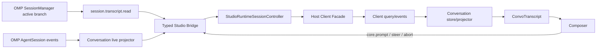

# OMP Studio 真实对话区接入：总控计划

> 状态：待执行
> 编写日期：2026-08-15
> 审查基线：`f69d7eb`，工作区存在大量未提交改动，执行者不得假设 clean tree
> 目标：让 Workbench 对话区读取并展示当前 OMP `AgentSession` 的真实内容，能够发送、流式接收、展示工具执行、处理失败并在重载/重连后恢复。

## 1. 为什么需要重排原计划

原来的 “Port convo UI” 计划主要迁移预览 fixture、batch 外观和 Interaction Deck，并把 `session.transcript` 排除在本轮之外。该范围只能让预览看起来像对话，真实模式仍会显示“contract 不暴露 transcript”的空态，无法实现本项目当前目标。

本计划把真实对话拆成三个层次：

1. **MVP-A：真实最终消息**——能向当前 OMP session 发送文本，并显示持久化后的 user/assistant 最终消息。
2. **MVP-B：可用的实时编码对话**——assistant 文本流式更新，工具 start/update/end 可见，错误、Abort、重连和滚动行为可靠。
3. **完整产品闭环**——新建/恢复/切换 session，真实提问/审批，窗口 reload 后恢复 pending 状态。

只有 MVP-B 完成，才可对外宣称“对话区可用”。MVP-A 是中间验收点，不是最终交付。

## 2. 最终用户验收场景

必须用预览关闭的 Desktop 应用逐条验证：

1. 用户选择或恢复工作区，Runtime 自动启动，Composer 可输入且发送按钮可用。
2. 用户发送“读取 package.json 并说明项目结构”。
3. 对话列立即出现本次 user 消息；Host accepted 后不能被误标为最终成功。
4. OMP 生成回复时，同一个 assistant 节点增量更新，不产生重复气泡。
5. OMP 调用 Read/Bash/Task/Ask 等工具时，对话列展示真实工具名、状态、经过脱敏和限长的参数/结果；失败工具明确显示错误。
6. Terminal receipt 为 failed/rejected/outcome_unknown 时，对话区或 Composer 显示可理解的错误，输入内容不被静默丢失。
7. 用户点击 Abort 后，本轮停止，已收到内容保留并标明中止。
8. 用户上滚阅读旧消息时，新 delta 不抢滚动；回到底部后恢复自动跟随。
9. 刷新 Renderer 或 Runtime 短暂重连后，已完成消息从真实 transcript 恢复，不串到其他 session/runtime epoch。
10. 点击真实历史会话时，Runtime 确实 resume 对应 session，标题与 transcript 同时切换。
11. OMP 发出 GUI-owned 的提问/审批时 Deck 出现；提交或取消真正回到同一 Runtime interaction。
12. 预览开启仍使用 fixture；预览关闭绝不回退 mock。

## 3. 当前事实与主要缺口

### 3.1 已有能力

- Renderer 已调用 `core.prompt`、`core.steer`、`core.abort`。
- Desktop Host 可以把 Studio operation 发送给 Bridge。
- Vendor Runtime dispatcher 最终调用真实 `AgentSession.prompt/steer/followUp/abort`。
- `AgentSession` 已产生 message/tool/compaction/retry 等原生事件。
- `SessionManager` 持久化 append-only tree；`getBranch()` 能获得当前 active branch。
- Studio Bridge 已有 `eventSeq`、`stateVersion`、runtime epoch、gap detection 和 snapshot resync 基础。

### 3.2 生产级 P0

- Runtime hello 的真实 capability manifest 和 operator manifest 没有进入生产 Facade，Renderer `can("core.prompt")` 可能永久为 false。
- 持久 active workspace 没注入 `DesktopRuntimeSession`，应用重启后 Runtime 可能不启动。
- `createDesktopHostComposition` 和 `DesktopHostCompositionImpl` 使用了两个不同的 publication listener Set，Runtime 更新可能不进 Facade。
- clean install 没有可靠的 `runtime.install` seam；这不阻塞已有 Runtime 的开发验收，但阻塞全新机器验收。

### 3.3 对话读取链缺失

- 没有主 session 的结构化 transcript operation/query。
- `StudioSnapshotResponse.messagesCursor` 虽已预留，但 vendor snapshot 没返回。
- Runtime Bridge 事件联合不包含 message/tool/compaction 事件。
- Runtime controller publication 只有 snapshot 和 terminal outcomes。
- Client contract/reducer 没有 transcript page 或 conversation live event。
- Renderer 真实模式无条件显示空态。

### 3.4 会话与审批缺失

- History 点击只改本地选择和路由，没有调用真实 `session.resume`。
- “新对话”只进入 Workbench，没有创建新的 Runtime session。
- Desktop `session.resume/drop` 仍有 stub。
- Runtime interaction 事件还未可靠穿过 controller/facade；commandId/requestId、owner、generation、reload 恢复均未闭环。

## 4. 目标架构



数据源必须遵循以下规则：

- **历史权威源**：`SessionManager.getBranch()`，不是全量 `getEntries()`，也不是 session tree 元数据。
- **实时权威源**：`AgentSession.subscribe()` 的原生事件；禁止解析 ANSI/TUI 日志。
- **最终一致性**：live delta 只负责即时体验，`message.completed` 和 transcript page 负责权威收敛。
- **身份边界**：每个 page/event 都携带 `runtimeEpoch + sessionId`；切 epoch/session 时原子清空当前 timeline。
- **安全边界**：不传 provider payload、token、绝对私密路径或任意 HTML；工具数据必须 Host/Runtime 端限长、规范化、脱敏。

## 5. 合同冻结点

执行任何实现前，负责计划 02 的 Agent 必须先提交一份小而完整的 contract 变更。其他 Agent 只能在该 contract 上开发，不得各自发明事件结构。

建议公共类型放入 `packages/studio-protocol/src/contracts/conversation.ts`，并由 `packages/client-contract` 复用安全子集。

### 5.1 Transcript 查询

建议 Runtime operation 与 Client query 同名：

```ts
type SessionTranscriptRead = {
  kind: "session.transcript.read";
  cursor?: OpaqueCursor;
  limit?: number; // 1..100，默认 50
};

interface ConversationTranscriptPage {
  runtimeEpoch: RuntimeEpoch;
  sessionId: SessionId;
  branchLeafId: string | null;
  items: readonly ConversationItem[]; // 按时间正序
  olderCursor?: OpaqueCursor;
  headCursor: OpaqueCursor;
  hasMoreBefore: boolean;
}
```

语义：无 cursor 读取 active branch 的最新一页；`olderCursor` 向更早历史翻页；cursor 必须绑定 session、branch leaf/generation 和边界，过期时返回明确 stale error，不能静默读取另一分支。

### 5.2 持久 ConversationItem

最低集合：

- `message`：稳定 entry id、role、时间、结构化 content blocks。
- `compaction`：摘要、warning、时间和 entry id。
- `checkpoint` 或 `notice`：只映射 OMP 已有真实语义，不发明内容。

Content block 最低集合：

- `text`
- `thinking`（存在且允许公开时）
- `toolCall`：toolCallId、toolName、经过规范化的 arguments
- `toolResult`：toolCallId、文本/结构化摘要、isError

### 5.3 Live event

建议事件集合：

- `conversation.message.started`
- `conversation.message.delta`
- `conversation.message.completed`（携带权威完整 item）
- `conversation.tool.started`
- `conversation.tool.updated`
- `conversation.tool.completed`（携带权威完整结果）
- `conversation.turn.completed`
- `conversation.turn.aborted`
- `conversation.compaction.started/completed`
- `conversation.notice`

每个事件至少携带 `runtimeEpoch`、`sessionId`、稳定 message/tool id；delta 必须是增量片段，不能每 token 重发全文。

### 5.4 大小和安全限制

计划 02 必须把数值写进测试常量，而非散落 magic numbers。建议起点：

- transcript page：最多 100 items。
- 单 text/thinking block：最多 256 KiB，超出带 `truncated: true`。
- tool arguments/result：序列化后最多 256 KiB，最大深度 12。
- 单 Bridge frame 继续遵守现有上限；projector 需按约 16–33ms 合并高频 delta 或按固定字符阈值 flush。
- 删除 `providerPayload`、鉴权字段、环境变量秘密；路径是否显示必须使用现有 Host redaction 规则。

最终数值可由 contract Agent根据现有 frame 限制调整，但必须在合同冻结提交中明确。

## 6. 并行工作包与依赖

| 计划 | 负责人文件范围 | 可开始时间 | 主要交付 |
|---|---|---|---|
| 01 Production baseline | `apps/desktop`、少量 `packages/studio-host` | 立即 | Runtime 真启动、真 manifest、publication、发送冒烟 |
| 02 Contract + history | protocol、vendor transcript reader | 立即；先冻结 contract | active-branch page、cursor、snapshot head |
| 03 Runtime live events | vendor projector/service | 02 contract 合并后 | message/tool/compaction typed live events |
| 04 Host + client | studio-host、host-client-api、client | 02 contract 合并后；可用 fixtures 并行 | query/event 穿透、timeline store、receipt |
| 05 Renderer | renderer conversation 模块 | 02 contract 合并后；先用 typed fixtures | 真实 transcript UI、stream merge、scroll/error |
| 06 Session + interaction | desktop/host/facade | 01、04 后 | resume/new/reload、真实 Deck |
| 07 Integration gate | testkit、跨层测试、文档 | 各包完成后持续接入 | E2E 与发布门禁 |

### 6.1 推荐波次

**Wave 0（可并行）**

- Agent A 执行 01。
- Agent B 执行 02，先提交 contract-only commit，再继续 Runtime history reader。

**Wave 1（contract-only commit 合并后并行）**

- Agent C 执行 03 的独立 projector/service 与测试；等 02 Commit B 释放 `StateProjector`/bridge server 后再做最终接线。
- Agent D 执行 04，先用 protocol fixtures 模拟事件；若 01 尚未释放 `bridge-client.ts`，先做 client-contract、client projector 和 Facade fixtures，不触碰该文件。
- Agent E 执行 05，先用 typed fixture 驱动组件。

**Wave 2**

- 合并 02 history reader → 04 Host query → 05 Renderer hydrate，完成 MVP-A。
- 合并 03 live events → 04 client projector → 05 live merge，完成 MVP-B。

**Wave 3**

- 执行 06。
- 执行 07 全链验收和故障注入。

## 7. 冲突控制与合并顺序

1. 当前工作区已存在用户改动。每个 Agent 开工前先运行 `git status --short`，记录自己认领的文件。
2. 修改既有文件前，按根 `AGENTS.md` 创建 `backup/YYYY-MM-DD/<task>-HHmmss/`，保持项目相对路径并写 README。
3. 不允许两个 Agent 同时修改：
   - `packages/studio-protocol/src/contracts/protocol.ts`
   - `packages/studio-protocol/src/validation.ts`
   - `packages/client-contract/src/lifecycle.ts`
   - `apps/renderer/src/App.tsx`
   - `apps/desktop/src/host-composition.ts`
4. 计划 02 是 conversation contract 的唯一 owner；计划 03/04/05 提需求时通过单独 follow-up，不直接改 contract。
5. 计划 05 是 `App.tsx` 和 `workbench.css` 的唯一 owner；其他 Agent 不改 UI。
6. 计划 01 完成后，计划 06 才可接手 `host-composition.ts`。
7. vendor 与 root protocol 必须在同一集成波次保持镜像；每次 contract 改动都运行 `npm run omp:verify:patches`。
8. `packages/studio-host/src/bridge-client.ts` 先由 01 处理 manifest，再交给 04 增 transcript API；禁止并发编辑。
9. vendor `state-projector.ts`/bridge server 先由 02 接 `messagesCursor`，再交给 03 接 live projector；禁止并发编辑。

推荐合并顺序：

1. 02 contract-only
2. 01 production baseline
3. 02 Runtime history reader
4. 04 Host/client history path
5. 05 Renderer history hydrate（MVP-A）
6. 03 Runtime live events
7. 04/05 live path（MVP-B）
8. 06 session/interaction
9. 07 final gate

## 8. 全局禁止事项

- 不用 preview fixture 填真实模式。
- 不从终端文本、ANSI 或日志推断对话。
- 不把 `ClientEvent` 日志当 transcript。
- 不对 Host/用户输入使用 `dangerouslySetInnerHTML`。
- 不把全量 `getEntries()` 当 active conversation；必须使用 active branch。
- 不把每个 token 的完整累计字符串作为事件发送。
- 不跨 runtime epoch/session 合并消息。
- 不在失败时吞异常或清空无法恢复的 Composer 文本。
- 不为了 Deck 队列伪造多个 pending；当前 Runtime/adapter 的 pending 语义需先核实并按真实能力呈现。
- 不顺手重构无关页面、样式或发现系统。

## 9. 总体验收与 Definition of Done

### MVP-A

- [ ] 生产 Runtime 能从 persisted workspace 启动。
- [ ] capability/command manifest 来自已认证 Runtime。
- [ ] `core.prompt` 可从 Renderer 到达 OMP。
- [ ] `session.transcript.read` 返回 active branch 最新页和 older cursor。
- [ ] 真实模式显示持久 user/assistant/tool result。
- [ ] reload 后已完成消息恢复。

### MVP-B

- [ ] assistant delta 更新同一消息。
- [ ] 工具 start/update/end 更新同一工具行。
- [ ] completed item 对 live buffer 做权威替换。
- [ ] gap/重连通过 transcript 补读恢复。
- [ ] abort、failed、rejected、outcome_unknown 有明确 UI。
- [ ] scroll-follow 行为满足验收场景。
- [ ] 预览/真实严格隔离。

### 完整闭环

- [ ] history click 真正 resume。
- [ ] 新对话创建新的 Runtime session 或明确采用经过确认的 reset 语义。
- [ ] GUI-owned interaction 能提交，TUI-owned 不显示为可提交。
- [ ] reload/rebind/runtime loss 不残留旧 interaction 或旧 conversation。
- [ ] Desktop + 真 Runtime E2E 通过。
- [ ] `npm run check`、`npm run omp:verify:patches` 通过。

## 10. 工作量预估

- MVP-A：8–12 工程日。
- MVP-B：累计 15–24 工程日。
- 完整闭环：累计 23–39 工程日。

多 Agent 可以缩短日历时间，但 contract、Runtime history、Host query、Renderer hydrate 存在硬依赖，不能简单按人数等比压缩。

## 11. 子计划索引

- [01-production-baseline.md](./01-production-baseline.md)
- [02-contract-and-runtime-history.md](./02-contract-and-runtime-history.md)
- [03-runtime-live-events.md](./03-runtime-live-events.md)
- [04-host-client-conversation.md](./04-host-client-conversation.md)
- [05-renderer-conversation-ui.md](./05-renderer-conversation-ui.md)
- [06-session-and-interactions.md](./06-session-and-interactions.md)
- [07-integration-verification.md](./07-integration-verification.md)

## 12. 可直接分发给 Agent 的任务说明

派发时应把对应子计划全文作为权威要求，并附以下公共前缀：

```text
你不是独自在代码库中工作。当前 worktree 有用户未提交改动；不要回滚、覆盖或格式化无关内容。
严格执行根 AGENTS.md：先读相关 package.json/types/tests；修改既有文件前创建规范 backup；只修改本计划认领的文件。
先写/更新能证明缺口的测试，再实现；完成后运行计划列出的逐包命令并提交一份执行报告。
若发现必须修改其他计划 owner 的 contract/文件，停止该部分并把最小变更请求发给总控，不要自行跨界。
```

推荐派发标题：

- Agent A：`执行真实对话计划 01：Desktop/Host production baseline`
- Agent B：`执行真实对话计划 02：conversation contract + active-branch transcript`
- Agent C：`执行真实对话计划 03：Runtime message/tool live projector`
- Agent D：`执行真实对话计划 04：Host/client conversation query + state`
- Agent E：`执行真实对话计划 05：Renderer real conversation UI`
- Agent F：`执行真实对话计划 06：session lifecycle + interaction`
- Agent G：`执行真实对话计划 07：integration/E2E gate`

每个 Agent 的最终回报必须包含：修改文件、备份路径、测试命令与结果、未完成项、需要其他 owner 配合的接口；“代码已写但未跑测试”不得标为完成。
